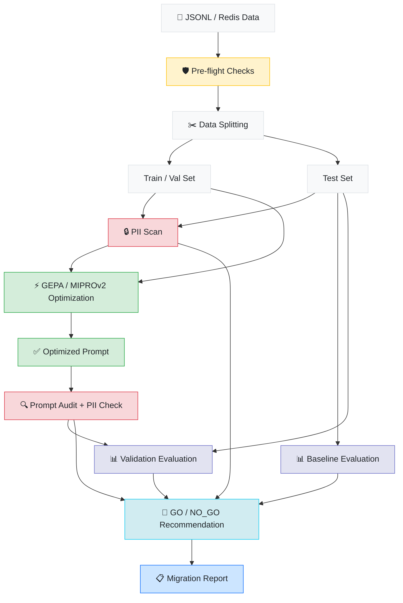
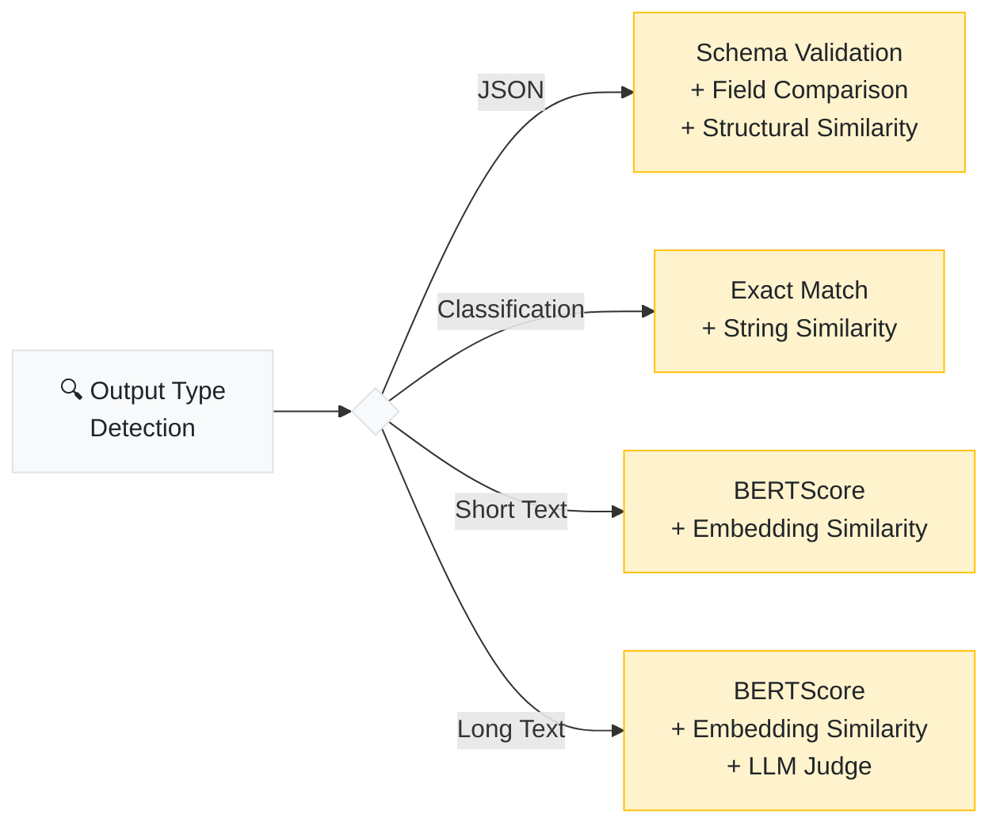

<p align="center">
  
</p>

<p align="center">
  <a href="LICENSE"></a>
  <a href="https://www.python.org/downloads/"></a>
  
</p>

<p align="center">
  <a href="#overview">Overview</a> &nbsp;&nbsp;|&nbsp;&nbsp;
  <a href="#get-started">Get Started</a> &nbsp;&nbsp;|&nbsp;&nbsp;
  <a href="#under-the-hood">Under the Hood</a> &nbsp;&nbsp;|&nbsp;&nbsp;
  <a href="#web-dashboard">Web Dashboard</a> &nbsp;&nbsp;|&nbsp;&nbsp;
  <a href="#enterprise-test-datasets">Datasets</a> &nbsp;&nbsp;|&nbsp;&nbsp;
  <a href="#docker">Docker</a> &nbsp;&nbsp;|&nbsp;&nbsp;
  <a href="#architecture">Architecture</a> &nbsp;&nbsp;|&nbsp;&nbsp;
  <a href="#glossary">Glossary</a> &nbsp;&nbsp;|&nbsp;&nbsp;
  <a href="DEVLOG.md">Dev Log</a>
</p>

---

## Overview

When teams migrate between LLM providers, their prompts break. Different models interpret the same instructions differently — formatting changes, reasoning shifts, outputs come back looking nothing like before. The fix today is manual re-engineering, which typically consumes 20–50% of the original development effort.

RosettaStone automates this process end-to-end. It takes your existing prompt/response pairs, optimizes your prompts for the target model using reflective optimization, validates the results against a held-out test set, and delivers a go/no-go recommendation — all in a single command.

```bash
rosettastone migrate \
  --data production_pairs.jsonl \
  --from openai/gpt-4o \
  --to anthropic/claude-sonnet-4
```

```
✓ Migration complete

  Recommendation ····· GO
  Confidence ·········· 92%
  Baseline ············ 61%
  Improvement ········· +31%
  Cost ················ $4.20
  Report ·············· ./migration_output/migration_report.md

─────────────────────────── Prompt Evolution ───────────────────────────
  Before  61%  →  After  92%  (+31%)

  ╭── GEPA-Optimized System Instruction ─────────────────────────────╮
  │  You are a financial document extraction system. Extract the      │
  │  following fields from invoice text and return ONLY valid JSON:   │
  │  vendor_name, invoice_number, invoice_date (YYYY-MM-DD),          │
  │  due_date, line_items (array), subtotal, tax_rate, tax_amount,    │
  │  total, currency (ISO 4217). Use null for missing fields.         │
  │                          full prompt in optimized_prompt.txt      │
  ╰───────────────────────────────────────────────────────────────────╯

  Top 3 Improvements
  ─────────────────────────────────────────────────────────────────────
   #    Type    Before   After   Delta    Win?
   12   json     0.12    0.97   +0.850   no→YES
   34   json     0.18    0.94   +0.760   no→YES
   7    json     0.21    0.91   +0.700   no→YES
```

The core insight: your production data already defines how your model should behave. The old model's outputs are the ground truth — RosettaStone uses them as the optimization target.

---

## Get Started

### Installation

```bash
pip install rosettastone

pip install "rosettastone[eval]"   # adds BERTScore & sentence-transformers
pip install "rosettastone[web]"    # adds FastAPI web dashboard
pip install "rosettastone[all]"    # includes everything (redis, eval, web, auth, postgres, etc.)
```

### Configuration

```bash
export OPENAI_API_KEY=sk-...        # powers the optimization engine
export ANTHROPIC_API_KEY=sk-ant-... # if migrating to an Anthropic model
```

### Usage

**CLI**

```bash
# run a full migration with the included sample data
rosettastone migrate \
  --data examples/sample_data.jsonl \
  --from openai/gpt-4o \
  --to anthropic/claude-sonnet-4

# estimate cost before running
rosettastone migrate \
  --data data.jsonl \
  --from openai/gpt-4o \
  --to anthropic/claude-sonnet-4 \
  --dry-run

# run pre-flight checks only
rosettastone preflight \
  --data data.jsonl \
  --from openai/gpt-4o \
  --to anthropic/claude-sonnet-4

# ingest from a Redis LLM proxy cache instead of JSONL
rosettastone migrate \
  --redis-url redis://localhost:6379 \
  --from openai/gpt-4o \
  --to anthropic/claude-sonnet-4

# use MIPROv2 optimizer instead of GEPA
rosettastone migrate \
  --data data.jsonl \
  --from openai/gpt-4o \
  --to anthropic/claude-sonnet-4 \
  --optimizer mipro --mipro-auto medium

# run without external API calls (local evaluation only)
rosettastone migrate \
  --data data.jsonl \
  --from openai/gpt-4o \
  --to anthropic/claude-sonnet-4 \
  --local-only

# migrate a multi-step pipeline / agent workflow
rosettastone migrate \
  --pipeline pipeline_config.yaml \
  --from openai/gpt-4o \
  --to anthropic/claude-sonnet-4

# run multiple migrations from a manifest file
rosettastone batch --manifest migrations.yaml --output ./batch_output
```

**Python Library**

```python
from rosettastone import Migrator, MigrationConfig

result = Migrator(MigrationConfig(
    source_model="openai/gpt-4o",
    target_model="anthropic/claude-sonnet-4",
    data_path="production_pairs.jsonl",
)).run()

print(f"Recommendation: {result.recommendation}")
print(f"Confidence: {result.confidence_score:.0%}")
print(f"Improvement: +{result.improvement:.0%}")
print(f"Cost: ${result.cost_usd:.2f}")
```

---

## Under the Hood

### Pipeline



### Step Breakdown

| Step | Description |
|:---|:---|
| **Pre-flight Checks** | Validates that the migration is feasible — context window compatibility, feature support, tokenizer differences — and estimates API cost (including LLM judge and optimizer costs). Runs automatically, or standalone with `--dry-run`. |
| **Data Splitting** | Deduplicates pairs, detects output types (JSON, classification, free text), and splits into train/validation/test sets. The test set is held out from optimization entirely. |
| **PII Scan** | Scans all prompt/response pairs for PII (emails, phone numbers, SSNs, credit cards, IP addresses). High-severity findings are flagged as blockers. |
| **Baseline Evaluation** | Runs the test set through the target model using your original prompts. This measures the "migration gap" — how much breaks without any optimization. |
| **Optimization** | Uses [GEPA](https://arxiv.org/abs/2507.19457) (default) or MIPROv2 (fallback) to iteratively improve prompt instructions. Known-issue feedback from training pairs is prepended to guide the optimizer. |
| **Prompt Safety** | Audits the optimized prompt for training data leakage (verbatim substrings) and checks for PII that may have been injected during optimization. |
| **Validation** | Runs the same held-out test set through the target model with the optimized prompt. Evaluates with per-output-type metrics including LLM-as-judge for long text. |
| **Recommendation** | Produces a GO / NO_GO / CONDITIONAL decision based on per-output-type win rates vs configurable thresholds, sample size adequacy (Wilson score CI), and safety findings. |
| **Prompt Evolution** | Displays the GEPA-generated system instruction alongside the baseline→optimized score delta and top 3 test cases where optimization helped most — making it clear what changed and why the target model improved. |
| **Migration Report** | Generates a 10-section markdown report: executive summary, recommendation, prompt evolution, per-type breakdown with confidence intervals, score distributions, safety findings, cost summary, and configuration. |

### Evaluation Strategy

RosettaStone auto-selects evaluation metrics based on your output type:



Composite scores use weighted metrics with per-output-type thresholds. JSON evaluation uses gated scoring — if the output isn't valid JSON, the composite score is 0 regardless of other metrics.

### Decision Engine

The recommendation engine evaluates results per output type with configurable thresholds:

| Output Type | Default Threshold |
|:---|:---|
| JSON | 95% win rate |
| Classification | 90% win rate |
| Short Text | 80% win rate |
| Long Text | 75% win rate |

Decision rules (in priority order):
1. Any HIGH-severity safety finding (PII in optimized prompt) → **NO_GO**
2. Any output type below its threshold → **CONDITIONAL** with specifics
3. Any output type with < 10 samples → **CONDITIONAL** with insufficient-data caveat
4. All types pass with adequate samples → **GO**

---

## Data Format

### JSONL (default)

Input is a JSONL file with one prompt/response pair per line. Prompts can be plain text or OpenAI messages format:

```jsonl
{"prompt": "Summarize this article: ...", "response": "The article discusses...", "source_model": "openai/gpt-4o"}
{"prompt": [{"role": "system", "content": "..."}, {"role": "user", "content": "..."}], "response": "...", "source_model": "openai/gpt-4o"}
```

| Field | Required | Description |
|:---|:---:|:---|
| `prompt` | yes | Plain text or OpenAI messages array |
| `response` | yes | The source model's output |
| `source_model` | yes | LiteLLM model identifier (e.g. `openai/gpt-4o`) |
| `metadata` | | Arbitrary key-value pairs |
| `feedback` | | Known issues with this particular response (used by optimizer) |
| `known_issue` | | `true` if this pair is a known regression — optimizer weights it 2× harder |
| `input_tokens` | | Token count for the prompt |
| `output_tokens` | | Token count for the response |
| `timestamp` | | When this pair was generated |

> **Dataset size:** minimum 20 pairs, recommended 50–200.

### Redis

RosettaStone can ingest directly from a Redis LLM proxy cache (e.g. LiteLLM's cache). Use `--redis-url` instead of `--data`:

```bash
rosettastone migrate \
  --redis-url redis://localhost:6379 \
  --from openai/gpt-4o \
  --to anthropic/claude-sonnet-4
```

The adapter uses `SCAN` (non-blocking), auto-detects the cache format by sampling keys, and handles mixed/unparseable entries gracefully. Requires the `redis` Python package.

### Other Adapters

| Adapter | Flag | Notes |
|:---|:---|:---|
| LangSmith | `--adapter langsmith` | Ingests runs from a LangSmith project |
| Braintrust | `--adapter braintrust` | Ingests logs from a Braintrust project |
| OpenTelemetry | `--adapter otel` | Ingests spans from an OTLP export file |

### Custom OpenAI-Compatible Endpoints

RosettaStone works with any OpenAI-compatible API endpoint (vLLM, Ollama, Ray Serve, local clusters) via standard LiteLLM env vars:

```bash
OPENAI_API_BASE=http://10.0.0.1:8000/v1 \
OPENAI_API_KEY=dummy \
rosettastone migrate \
  --data examples/datasets/fintech_extraction/fintech_extraction_gpt4o.jsonl \
  --from openai/gpt-4o \
  --to openai/Qwen/Qwen3-30B-A3B \
  --auto light
```

The `openai/` prefix in `--to` tells LiteLLM to use the OpenAI-compatible client against your `OPENAI_API_BASE`.

---

## Enterprise Test Datasets

The `examples/datasets/` directory contains five production-quality datasets covering the most common enterprise LLM deployment patterns. Each includes 300–400 prompt/response pairs generated from both GPT-4o and Claude Haiku — giving you real baselines for two common migration scenarios.

| Dataset | Pairs | Use Case | Output Type |
|:---|:---:|:---|:---|
| [`fintech_extraction`](examples/datasets/fintech_extraction/) | 400 | Invoice/receipt field extraction from unstructured text | JSON |
| [`support_classification`](examples/datasets/support_classification/) | 400 | Customer support ticket categorization into 8 labels | JSON |
| [`sql_generation`](examples/datasets/sql_generation/) | 300 | Natural language → PostgreSQL query generation | Short text |
| [`ecommerce_products`](examples/datasets/ecommerce_products/) | 300 | Product spec → marketing copy generation | Long text |
| [`enterprise_rag`](examples/datasets/enterprise_rag/) | 300 | RAG chatbot over a synthetic company knowledge base | Short/long text |

Each dataset ships with two JSONL files (`_gpt4o.jsonl` and `_haiku.jsonl`), a `cost_summary.json`, and a `SOURCES.md` with data provenance and license notes.

**Running a migration with these datasets:**

```bash
# Migrating off GPT-4o (cost reduction story)
rosettastone migrate \
  --data examples/datasets/fintech_extraction/fintech_extraction_gpt4o.jsonl \
  --from openai/gpt-4o \
  --to anthropic/claude-sonnet-4 \
  --auto light

# Migrating off Anthropic (data residency story)
rosettastone migrate \
  --data examples/datasets/enterprise_rag/enterprise_rag_haiku.jsonl \
  --from anthropic/claude-haiku-4-5-20251001 \
  --to anthropic/claude-sonnet-4 \
  --auto medium
```

The `enterprise_rag` dataset includes a synthetic knowledge base in `data/meridian_knowledge_base/` (25 Markdown documents) — a fictional B2B SaaS company covering product docs, API reference, pricing, onboarding, HR policies, and release notes. Generation scripts for all datasets are in `scripts/generate_*.py`.

---

## Batch Runner

Migrate multiple models at once from a YAML manifest:

```yaml
# migrations.yaml
version: 1
defaults:
  gepa_auto: light
  output_dir: ./batch_output

migrations:
  - name: gpt4o-to-sonnet
    source_model: openai/gpt-4o
    target_model: anthropic/claude-sonnet-4
    data_path: data/gpt4o_pairs.jsonl

  - name: gpt4o-mini-to-haiku
    source_model: openai/gpt-4o-mini
    target_model: anthropic/claude-haiku-4-5
    data_path: data/mini_pairs.jsonl
    gepa_auto: medium
```

```bash
rosettastone batch --manifest migrations.yaml --output ./batch_output
```

Results are printed as a markdown table:

```
| Name              | Source → Target                      | Status   | Recommendation | Confidence |
|-------------------|--------------------------------------|----------|----------------|------------|
| gpt4o-to-sonnet   | openai/gpt-4o → anthropic/claude-... | COMPLETE | GO             | 89%        |
| gpt4o-mini-to-haiku | openai/gpt-4o-mini → anthropic/... | COMPLETE | CONDITIONAL    | 74%        |
```

---

## Estimated Cost & Performance

For 100 prompt/response pairs using default settings (`--auto light`):

| Target Model | Est. Cost | Est. Time |
|:---|:---|:---|
| GPT-4o-mini | $0.50 – $2 | 5 – 15 min |
| Claude Haiku 4.5 | $2 – $6 | 10 – 25 min |
| GPT-4o | $5 – $15 | 15 – 45 min |
| Claude Sonnet 4.5 | $8 – $20 | 20 – 60 min |

Optimization intensity is configurable via `--auto`: `light` (default), `medium`, or `heavy`.
Higher intensity = more API calls, better results.

| Intensity | GEPA Iterations | Est. Time (100 pairs) | When to use |
|:---|:---:|:---|:---|
| `light` | 25 | 10 – 25 min | Fast iterations, good for initial validation |
| `medium` | 50 | 25 – 45 min | Production migrations, balanced cost/quality |
| `heavy` | 100 | 45 – 90 min | High-stakes migrations, maximizes optimization |

> Use `--dry-run` to get a cost estimate before committing. Cost estimates include LLM judge calls and MIPROv2 overhead when applicable.

---

## Web Dashboard

RosettaStone includes a full-featured web UI for exploring migration results, running A/B tests, managing approvals, and collaborating with your team.

```bash
# install web dependencies
pip install "rosettastone[web]"

# start the dashboard (single-user, no auth)
uvicorn rosettastone.server.app:create_app --factory --port 8000

# start with API key auth
ROSETTASTONE_API_KEY=your-key uvicorn rosettastone.server.app:create_app --factory --port 8000

# start with full multi-user auth (JWT + RBAC)
ROSETTASTONE_MULTI_USER=true \
ROSETTASTONE_JWT_SECRET=your-32-byte-secret \
uvicorn rosettastone.server.app:create_app --factory --port 8000

# open http://localhost:8000/ui/
```

### Pages

| Page | URL | Description |
|:---|:---|:---|
| Models | `/ui/` | Active models, deprecation warnings, model explorer |
| Migrations | `/ui/migrations` | Migration history with go/no-go recommendations |
| Migration Detail | `/ui/migrations/{id}` | Answer-first layout: recommendation, KPIs, per-type breakdown, regressions with diff view, score charts, version timeline |
| Executive View | toggle on detail page | Compact card for stakeholders: confidence score, one-line recommendation, cost summary |
| Costs | `/ui/costs` | Spend breakdown by model, optimization opportunities |
| Alerts | `/ui/alerts` | Deprecation warnings, price changes, new model availability |
| Pipelines | `/ui/pipelines` | Multi-step pipeline migration status |
| Pipeline Detail | `/ui/pipelines/{id}` | Per-module optimization progress |
| A/B Tests | `/ui/ab-tests` | Compare two migration versions with statistical significance |
| A/B Test Detail | `/ui/ab-tests/{id}` | Win rate bars, p-value badge, score distributions |
| Audit Log | `/ui/audit-log` | Filterable history of all user actions |
| Users | `/ui/users` | User management (admin only) |
| Teams | `/ui/teams` | Team and membership management |
| Annotations | `/ui/annotations` | Annotation queue for test case review |

### Authentication

| Mode | How to enable | Who can use it |
|:---|:---|:---|
| No auth (default) | Don't set any auth env vars | Anyone with network access |
| API key | `ROSETTASTONE_API_KEY=secret` | Bearer token or UI login |
| Multi-user JWT + RBAC | `ROSETTASTONE_MULTI_USER=true` + `ROSETTASTONE_JWT_SECRET=...` | Individual user accounts with roles |

**Roles:** `viewer` (read-only) → `editor` (create/edit) → `approver` (editor + approve migrations) → `admin` (all + user management). The first registered user is automatically assigned the `admin` role.

### A/B Testing

Compare two versions of a migrated prompt to measure which performs better:

1. Run a migration and let it create Version A
2. Rollback or modify to create Version B
3. Create an A/B test, set your traffic split, and click Start
4. RosettaStone re-evaluates your test cases deterministically across both versions
5. View win rates, score distributions, and chi-squared significance

### Approval Workflows

Require sign-off before a migration is marked production-ready:

```http
POST /api/v1/migrations/{id}/approval-workflow
{ "required_approvals": 2 }

POST /api/v1/migrations/{id}/approve
{ "comment": "Looks good — JSON outputs are clean" }
```

The workflow auto-approves when the required approval count is reached.

---

## Docker

Run the full stack with Docker Compose:

```bash
# SQLite (default) — single container, data persisted to a Docker volume
docker compose up

# with PostgreSQL
docker compose --profile postgres up

# with Redis (for cache ingestion)
docker compose --profile redis up
```

Environment variables (set in `.env` or `docker-compose.yml`):

| Variable | Default | Description |
|:---|:---|:---|
| `DATABASE_URL` | SQLite | PostgreSQL connection string (e.g. `postgresql://user:pass@db/rosettastone`) |
| `REDIS_URL` | none | Redis connection string |
| `ROSETTASTONE_API_KEY` | none | Enables API key auth |
| `ROSETTASTONE_MULTI_USER` | `false` | Enables multi-user JWT auth |
| `ROSETTASTONE_JWT_SECRET` | dev default | **Set a strong secret in production** |
| `OPENAI_API_KEY` | required | For optimization and LLM judge |
| `ANTHROPIC_API_KEY` | optional | If migrating to Anthropic models |

**Production deployment:** The entrypoint runs `alembic upgrade head` before starting the server — schema migrations are applied automatically on container start.

```bash
# build and run manually
docker build -t rosettastone .
docker run -p 8000:8000 \
  -e OPENAI_API_KEY=sk-... \
  -e ROSETTASTONE_API_KEY=your-secret \
  rosettastone
```

---

## Pipeline Migration

Migrate multi-step LLM chains or agent workflows in a single pass. Define your pipeline as a YAML DAG:

```yaml
# pipeline_config.yaml
pipeline:
  name: customer-support-pipeline
  source_model: openai/gpt-4o
  target_model: anthropic/claude-sonnet-4
  data_path: data/support_pairs.jsonl

  modules:
    - name: classify_intent
      prompt_template: "Classify the customer's intent..."
      input_fields: [customer_message]
      output_fields: [intent, urgency]

    - name: draft_response
      prompt_template: "Draft a support response..."
      input_fields: [customer_message, intent, urgency]
      output_fields: [response_draft]
      depends_on: [classify_intent]

    - name: quality_check
      prompt_template: "Review this response for quality..."
      input_fields: [response_draft]
      output_fields: [final_response, quality_score]
      depends_on: [draft_response]
```

```bash
rosettastone migrate --pipeline pipeline_config.yaml \
  --from openai/gpt-4o --to anthropic/claude-sonnet-4
```

Each module is optimized independently (teacher/student), and per-module results are tracked in the dashboard. Circular dependencies are caught at parse time.

---

## Architecture

```
src/rosettastone/
│
├── cli/
│   ├── main.py           Typer CLI — migrate, preflight, batch
│   └── display.py        Rich progress bars, summary tables, recommendation panels
│
├── core/
│   ├── migrator.py       Orchestrator — runs the full pipeline with PipelineContext
│   ├── pipeline.py       Step definitions, routing (Redis/JSONL, GEPA/MIPROv2)
│   ├── context.py        PipelineContext — accumulates warnings, costs, timing
│   └── types.py          PromptPair, EvalResult, MigrationResult
│
├── config.py             MigrationConfig (Pydantic v2)
├── preflight/            Capability checks, token budgets, cost estimation
├── ingest/               DataAdapter interface — JSONL, Redis, LangSmith, Braintrust, OTel
├── optimize/             GEPA + MIPROv2 wrappers, pipeline optimizer, teacher/student,
│                         feedback utilities, DSPy metric, pipeline config parser
├── evaluate/             BERTScore, embeddings (lru_cache), exact match, JSON validation,
│                         JSON structural similarity, LLM-as-judge, composite evaluator
├── safety/               PII scanner (regex), prompt auditor (leakage detection)
├── decision/             Recommendation engine, Wilson CI statistics, A/B stats engine
├── report/               Jinja2 markdown report generation, HTML report with Chart.js
│
├── batch.py              Batch migration runner (YAML manifest → multiple migrations)
│
└── server/               Web UI — FastAPI + Jinja2 + HTMX + Tailwind CSS
    ├── app.py            create_app() factory, executor, startup/shutdown hooks
    ├── models.py         SQLModel table definitions (18 tables)
    ├── database.py       Engine + session factory; SQLite WAL / PostgreSQL support
    ├── schemas.py        Pydantic request/response schemas
    ├── auth_utils.py     bcrypt password hashing, JWT encode/decode
    ├── rbac.py           require_role() FastAPI dependency
    ├── csrf.py           CSRF middleware (HMAC tokens)
    ├── ab_runner.py      A/B test background runner (simulation + live modes)
    ├── pipeline_runner.py Pipeline background runner
    └── api/              API routers: migrations, tasks, versioning, ab_testing,
                          pipelines, annotations, approvals, teams, users, auth,
                          audit, alerts, costs, comparisons, reports, …
```

**Design principles:**

- **Provider-agnostic** — supports 100+ models through [LiteLLM](https://github.com/BerriAI/litellm)
- **Pluggable** — abstract base classes for data adapters, optimizers, and evaluators
- **CLI = Library** — both paths construct a `MigrationConfig` and call `Migrator.run()`
- **Lazy optional deps** — `bert-score`, `sentence-transformers`, and `redis` load on demand with graceful fallbacks
- **PII-safe by default** — prompt content is never logged at any level
- **Database** — SQLite (WAL mode, default) or PostgreSQL via `DATABASE_URL`. Schema managed by Alembic; `alembic upgrade head` runs automatically on container start.

---

## CLI Reference

### `rosettastone migrate`

| Flag | Default | Description |
|:---|:---|:---|
| `--data`, `-d` | | Path to JSONL file |
| `--from` | required | Source model (LiteLLM identifier) |
| `--to` | required | Target model (LiteLLM identifier) |
| `--output`, `-o` | `./migration_output` | Output directory |
| `--auto` | `light` | GEPA intensity: `light` / `medium` / `heavy` |
| `--dry-run` | `false` | Estimate cost without running |
| `--redis-url` | | Redis URL for cache ingestion (replaces `--data`) |
| `--adapter` | `jsonl` | Data adapter: `jsonl` / `redis` / `langsmith` / `braintrust` / `otel` |
| `--optimizer` | `gepa` | Optimizer: `gepa` or `mipro` |
| `--mipro-auto` | | MIPROv2 preset: `light` / `medium` / `heavy` |
| `--judge-model` | `openai/gpt-4o` | Model for LLM-as-judge evaluation |
| `--reflection-model` | `openai/gpt-4o` | Model GEPA uses to reflect on failures |
| `--local-only` | `false` | Skip external API calls for evaluation |
| `--no-pii-scan` | `false` | Disable PII scanning |
| `--no-prompt-audit` | `false` | Disable prompt leakage auditing |
| `--pipeline` | | YAML pipeline config for multi-step migration |
| `--known-issue-weight` | `2.0` | Score divisor applied to `known_issue=true` pairs during optimization |
| `--skip-preflight` | `false` | Skip pre-flight checks |

### `rosettastone batch`

| Flag | Default | Description |
|:---|:---|:---|
| `--manifest`, `-m` | required | Path to batch YAML manifest |
| `--output`, `-o` | `./batch_output` | Base output directory |

### `rosettastone preflight`

| Flag | Default | Description |
|:---|:---|:---|
| `--data`, `-d` | required | Path to JSONL file |
| `--from` | required | Source model |
| `--to` | required | Target model |

### `rosettastone score-shadow`

Evaluate shadow deployment logs after running your target model in shadow mode alongside production.

| Flag | Default | Description |
|:---|:---|:---|
| `--log-dir` | `./shadow_logs` | Directory containing shadow log files |
| `--from` | required | Source (production) model |
| `--to` | required | Target (shadow) model |
| `--output`, `-o` | `./shadow_report` | Output directory for JSON summary |

### `rosettastone calibrate`

Calibrate win-rate thresholds from a human-labeled dataset to tune GO/CONDITIONAL/NO_GO decision boundaries for your specific domain.

| Flag | Default | Description |
|:---|:---|:---|
| `input_path` | required | Path to labeled calibration dataset JSON |
| `--output`, `-o` | `calibrated_thresholds.json` | Output path for calibrated thresholds |

---

## Roadmap

| Phase | Scope | Status |
|:---:|:---|:---:|
| **1** | CLI + Python library, JSONL ingestion, GEPA optimization, multi-strategy evaluation, markdown reports | ✅ Complete |
| **2** | Redis ingestion, LLM-as-judge evaluation, MIPROv2 optimizer, PII detection, prompt auditing, decision engine (GO/NO_GO), Rich CLI, per-output-type statistics | ✅ Complete |
| **3** | Web UI (FastAPI + HTMX + Tailwind), side-by-side diffs, executive reports, decision-first dashboard | ✅ Complete |
| **4** | LangSmith / Braintrust / OpenTelemetry adapters, batch runner, CI/CD integration | ✅ Complete |
| **5** | Docker deployment, version history, A/B testing, multi-step pipeline migration, team collaboration (RBAC, annotations, approvals) | ✅ Complete |
| **6** | Score charts, filterable test case grid, persona toggle (engineer/executive), known-issue GEPA weighting | ✅ Complete |
| **7** | Shadow deployment tooling, ROC threshold calibration, 5 enterprise test datasets (fintech, support, SQL, e-commerce, RAG) | ✅ Complete |

---

## Development

```bash
git clone https://github.com/ashwinchidambaram/rosettastone.git
cd rosettastone
uv sync --dev --all-extras

uv run pytest tests/ -v --ignore=tests/test_e2e   # 1414 unit/integration tests
uv run pytest tests/test_e2e/ -m playwright        # browser UI tests (requires server)
uv run ruff check src/ tests/                      # lint
uv run ruff format src/ tests/                     # format
uv run mypy src/rosettastone/                      # type check (0 errors, strict mode)
uv run alembic upgrade head                        # apply DB migrations
```

### E2E Testing

End-to-end tests exercise the full migration pipeline with real LLM API calls and Redis. They require API keys for OpenAI, Anthropic, and Google, plus a running Redis instance.

```bash
# smoke test only (~$0.21, ~2 min)
ROSETTASTONE_E2E_REDIS_URL=redis://localhost:6379/15 \
  uv run pytest tests/test_e2e/test_smoke.py -m e2e -v

# full suite — 7 scenarios across cross-provider, upgrade, and downgrade (~$14, ~30 min)
ROSETTASTONE_E2E_REDIS_URL=redis://localhost:6379/15 \
  uv run pytest tests/test_e2e/ -m e2e -v

# run via batch CLI
uv run rosettastone batch --manifest e2e_manifests/smoke.yaml --output ./e2e_output
```

**Scenarios:**

| Category | Scenarios | Expected |
|:---|:---|:---|
| Cross-provider | `gpt-4o-mini` → `claude-3-5-haiku`, `gpt-4o-mini` → `gemini-2.0-flash`, `gemini-2.0-flash` → `claude-3-5-haiku` | GO or CONDITIONAL |
| Model upgrade | `gpt-4o-mini` → `gpt-4o`, `claude-3-5-haiku` → `claude-sonnet-4` | High confidence GO |
| Model downgrade | `gpt-4o` → `gpt-4o-mini`, `claude-sonnet-4` → `claude-3-5-haiku` | CONDITIONAL or NO_GO |

Synthetic test data covers 6 domains (JSON extraction, classification, short Q&A, long explanation, code generation, rewriting) with 44 prompt/response pairs generated from the source model.

---

## Glossary

| Term | Definition |
|:---|:---|
| **GEPA** | Genetic-Pareto prompt optimizer ([ICLR 2026 Oral](https://arxiv.org/abs/2507.19457)). Instead of brute-forcing prompt variations, it reflects on *why* outputs diverge and proposes targeted fixes. ~35x fewer API calls than previous methods. |
| **MIPROv2** | Alternative DSPy optimizer. Used as a fallback when GEPA is not suitable. Runs in zero-shot mode (no production data in demos) for PII safety. |
| **DSPy** | Framework for programming language models as optimizable modules — handles the training loop, caching, and program compilation. [dspy.ai](https://dspy.ai) |
| **LiteLLM** | Universal API wrapper providing a single interface to 100+ LLM providers. |
| **BERTScore** | Semantic similarity metric computed locally (no API calls). More meaningful than string matching for evaluating free-text responses. |
| **LLM-as-Judge** | Uses a separate model (default: GPT-4o) to rate behavioral equivalence on a 1–5 Likert scale. Bidirectional (scores both orderings) to reduce position bias. |
| **Behavioral equivalence** | The migration objective — outputs from the new model should match the old model's intent, structure, and quality. Not word-for-word identical, but functionally equivalent. |
| **Pairwise win rate** | The confidence metric. 92% means the optimized prompt on the new model matched or exceeded the old model's output in 92 of 100 test cases. |
| **Wilson score interval** | Statistical confidence interval for win rates. Accounts for small sample sizes better than naive percentage calculations. Used to determine whether results are statistically reliable. |
| **PII scanner** | Regex-based detection of personally identifiable information (emails, phone numbers, SSNs, credit cards, IP addresses). High-severity PII in an optimized prompt is a migration blocker. |
| **Prompt auditor** | Checks if the optimized prompt contains verbatim substrings (30+ chars) from training data — a sign of data leakage. Filters out common boilerplate. |
| **Tokenizer inflation** | The same text produces different token counts across models. Moving from tiktoken (OpenAI) to SentencePiece (Anthropic) typically inflates token count by 15–20%. |
| **Reflection model** | The model GEPA uses to analyze failures and propose improvements. Defaults to GPT-4o, always separate from the migration target. |
| **Pre-flight checks** | Safety validation before the migration runs. Catches context window overflow, missing capabilities, and high cost estimates before any API spend. |
| **Known-issue weight** | Score divisor applied to `known_issue=true` training pairs. Default 2.0 — halves the composite score, telling GEPA to prioritize fixing these examples. |
| **Teacher/student** | Pipeline optimization mode. The source model acts as teacher (generating demonstrations); GEPA optimizes the student (target model) using teacher outputs as the reference. |

---

## References

- **[GEPA paper](https://arxiv.org/abs/2507.19457)** (ICLR 2026 Oral) — The core optimization algorithm behind RosettaStone. Introduces reflective prompt evolution that outperforms MIPROv2 by 10%+ while using ~35x fewer API calls.
- **[Dropbox — DSPy + GEPA in production](https://dropbox.tech/machine-learning/optimizing-dropbox-dash-relevance-judge-with-dspy)** — Production case study validating that GEPA + DSPy can optimize real-world LLM systems at scale, not just benchmarks.
- **[AWS — Prompt migration with DSPy MIPROv2](https://aws.amazon.com/blogs/machine-learning/improve-amazon-nova-migration-performance-with-data-aware-prompt-optimization/)** — AWS's reference architecture for data-aware prompt migration. Demonstrates the general pattern RosettaStone builds on, using the previous-generation optimizer.

---

<p align="center">
  <a href="https://github.com/ashwinchidambaram"></a>
</p>
