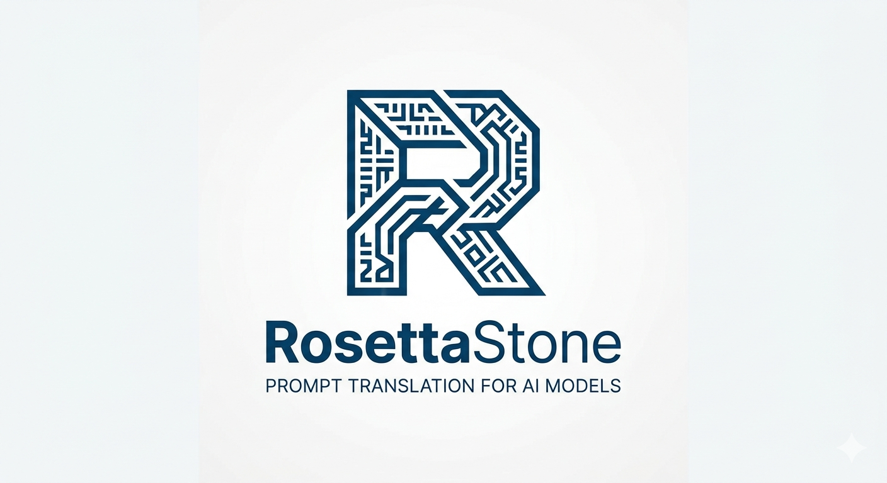
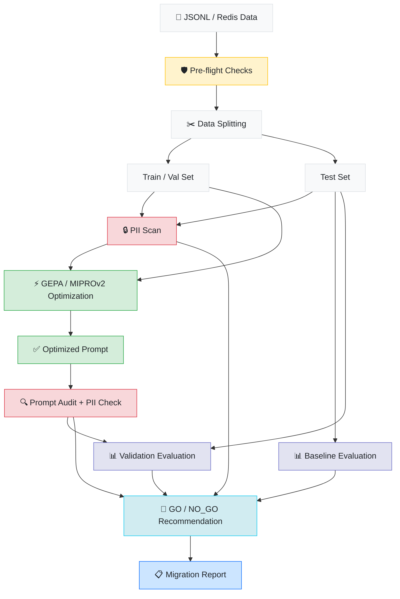
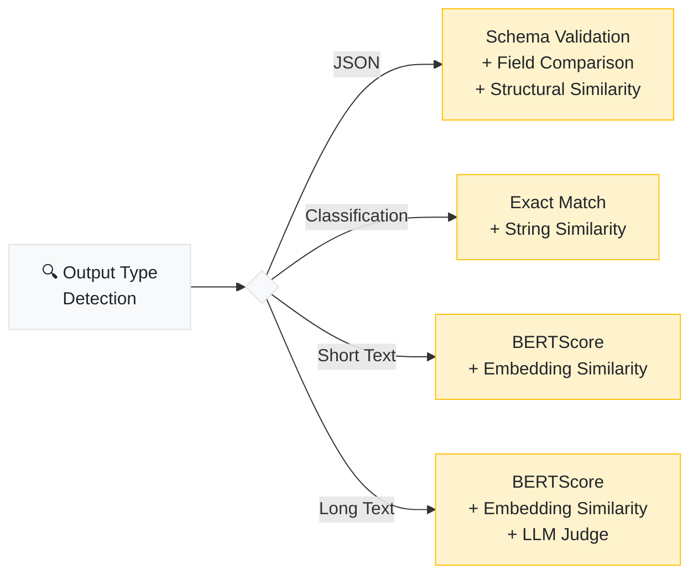

<p align="center">
  
</p>

<p align="center">
  <a href="LICENSE"></a>
  <a href="https://www.python.org/downloads/"></a>
  
</p>

<p align="center">
  <a href="#overview">Overview</a> &nbsp;&nbsp;|&nbsp;&nbsp;
  <a href="#get-started">Get Started</a> &nbsp;&nbsp;|&nbsp;&nbsp;
  <a href="#under-the-hood">Under the Hood</a> &nbsp;&nbsp;|&nbsp;&nbsp;
  <a href="#architecture">Architecture</a> &nbsp;&nbsp;|&nbsp;&nbsp;
  <a href="#glossary">Glossary</a> &nbsp;&nbsp;|&nbsp;&nbsp;
  <a href="#roadmap">Roadmap</a> &nbsp;&nbsp;|&nbsp;&nbsp;
  <a href="DEVLOG.md">Dev Log</a>
</p>

> **Note:** This project is actively under development and not yet production-ready. See the [Roadmap](#roadmap) for current progress and the [Dev Log](DEVLOG.md) for build updates.

---

## Overview

When teams migrate between LLM providers, their prompts break. Different models interpret the same instructions differently — formatting changes, reasoning shifts, outputs come back looking nothing like before. The fix today is manual re-engineering, which typically consumes 20–50% of the original development effort.

RosettaStone automates this process end-to-end. It takes your existing prompt/response pairs, optimizes your prompts for the target model using reflective optimization, validates the results against a held-out test set, and delivers a go/no-go recommendation — all in a single command.

```bash
rosettastone migrate \
  --data production_pairs.jsonl \
  --from openai/gpt-4o \
  --to anthropic/claude-sonnet-4
```

```
✓ Migration complete

  Recommendation ····· GO
  Confidence ·········· 92%
  Baseline ············ 61%
  Improvement ········· +31%
  Cost ················ $4.20
  Duration ············ 18.3m
  Report ·············· ./migration_output/migration_report.md
```

The core insight: your production data already defines how your model should behave. The old model's outputs are the ground truth — RosettaStone uses them as the optimization target.

---

## Get Started

### Installation

```bash
pip install rosettastone

pip install "rosettastone[eval]"   # adds BERTScore & sentence-transformers
pip install "rosettastone[web]"    # adds FastAPI web dashboard
pip install "rosettastone[all]"    # includes everything (redis, eval, web, etc.)
pip install "rosettastone[e2e]"    # E2E testing dependencies (eval + redis + web)
```

### Configuration

```bash
export OPENAI_API_KEY=sk-...        # powers the optimization engine
export ANTHROPIC_API_KEY=sk-ant-... # if migrating to an Anthropic model
```

### Usage

**CLI**

```bash
# run a full migration with the included sample data
rosettastone migrate \
  --data examples/sample_data.jsonl \
  --from openai/gpt-4o \
  --to anthropic/claude-sonnet-4

# estimate cost before running
rosettastone migrate \
  --data data.jsonl \
  --from openai/gpt-4o \
  --to anthropic/claude-sonnet-4 \
  --dry-run

# run pre-flight checks only
rosettastone preflight \
  --data data.jsonl \
  --from openai/gpt-4o \
  --to anthropic/claude-sonnet-4

# ingest from a Redis LLM proxy cache instead of JSONL
rosettastone migrate \
  --redis-url redis://localhost:6379 \
  --from openai/gpt-4o \
  --to anthropic/claude-sonnet-4

# use MIPROv2 optimizer instead of GEPA
rosettastone migrate \
  --data data.jsonl \
  --from openai/gpt-4o \
  --to anthropic/claude-sonnet-4 \
  --optimizer mipro --mipro-auto medium

# run without external API calls (local evaluation only)
rosettastone migrate \
  --data data.jsonl \
  --from openai/gpt-4o \
  --to anthropic/claude-sonnet-4 \
  --local-only
```

**Python Library**

```python
from rosettastone import Migrator, MigrationConfig

result = Migrator(MigrationConfig(
    source_model="openai/gpt-4o",
    target_model="anthropic/claude-sonnet-4",
    data_path="production_pairs.jsonl",
)).run()

print(f"Recommendation: {result.recommendation}")
print(f"Confidence: {result.confidence_score:.0%}")
print(f"Improvement: +{result.improvement:.0%}")
print(f"Cost: ${result.cost_usd:.2f}")
```

---

## Under the Hood

### Pipeline



### Step Breakdown

| Step | Description |
|:---|:---|
| **Pre-flight Checks** | Validates that the migration is feasible — context window compatibility, feature support, tokenizer differences — and estimates API cost (including LLM judge and optimizer costs). Runs automatically, or standalone with `--dry-run`. |
| **Data Splitting** | Deduplicates pairs, detects output types (JSON, classification, free text), and splits into train/validation/test sets. The test set is held out from optimization entirely. |
| **PII Scan** | Scans all prompt/response pairs for PII (emails, phone numbers, SSNs, credit cards, IP addresses). High-severity findings are flagged as blockers. |
| **Baseline Evaluation** | Runs the test set through the target model using your original prompts. This measures the "migration gap" — how much breaks without any optimization. |
| **Optimization** | Uses [GEPA](https://arxiv.org/abs/2507.19457) (default) or MIPROv2 (fallback) to iteratively improve prompt instructions. Known-issue feedback from training pairs is prepended to guide the optimizer. |
| **Prompt Safety** | Audits the optimized prompt for training data leakage (verbatim substrings) and checks for PII that may have been injected during optimization. |
| **Validation** | Runs the same held-out test set through the target model with the optimized prompt. Evaluates with per-output-type metrics including LLM-as-judge for long text. |
| **Recommendation** | Produces a GO / NO_GO / CONDITIONAL decision based on per-output-type win rates vs configurable thresholds, sample size adequacy (Wilson score CI), and safety findings. |
| **Migration Report** | Generates a 10-section markdown report: executive summary, recommendation, per-type breakdown with confidence intervals, score distributions, safety findings, cost summary, and configuration. |

### Evaluation Strategy

RosettaStone auto-selects evaluation metrics based on your output type:



Composite scores use weighted metrics with per-output-type thresholds. JSON evaluation uses gated scoring — if the output isn't valid JSON, the composite score is 0 regardless of other metrics.

### Decision Engine

The recommendation engine evaluates results per output type with configurable thresholds:

| Output Type | Default Threshold |
|:---|:---|
| JSON | 95% win rate |
| Classification | 90% win rate |
| Short Text | 80% win rate |
| Long Text | 75% win rate |

Decision rules (in priority order):
1. Any HIGH-severity safety finding (PII in optimized prompt) → **NO_GO**
2. Any output type below its threshold → **CONDITIONAL** with specifics
3. Any output type with < 10 samples → **CONDITIONAL** with insufficient-data caveat
4. All types pass with adequate samples → **GO**

---

## Data Format

### JSONL (default)

Input is a JSONL file with one prompt/response pair per line. Prompts can be plain text or OpenAI messages format:

```jsonl
{"prompt": "Summarize this article: ...", "response": "The article discusses...", "source_model": "openai/gpt-4o"}
{"prompt": [{"role": "system", "content": "..."}, {"role": "user", "content": "..."}], "response": "...", "source_model": "openai/gpt-4o"}
```

| Field | Required | Description |
|:---|:---:|:---|
| `prompt` | yes | Plain text or OpenAI messages array |
| `response` | yes | The source model's output |
| `source_model` | yes | LiteLLM model identifier (e.g. `openai/gpt-4o`) |
| `metadata` | | Arbitrary key-value pairs |
| `feedback` | | Known issues with this particular response (used by optimizer) |
| `input_tokens` | | Token count for the prompt |
| `output_tokens` | | Token count for the response |
| `timestamp` | | When this pair was generated |

> **Dataset size:** minimum 20 pairs, recommended 50–200.

### Redis

RosettaStone can ingest directly from a Redis LLM proxy cache (e.g. LiteLLM's cache). Use `--redis-url` instead of `--data`:

```bash
rosettastone migrate \
  --redis-url redis://localhost:6379 \
  --from openai/gpt-4o \
  --to anthropic/claude-sonnet-4
```

The adapter uses `SCAN` (non-blocking), auto-detects the cache format by sampling keys, and handles mixed/unparseable entries gracefully. Requires the `redis` Python package.

---

## Estimated Cost & Performance

For 100 prompt/response pairs using default settings (`--auto light`):

| Target Model | Est. Cost | Est. Time |
|:---|:---|:---|
| GPT-4o-mini | $0.50 – $2 | 5 – 15 min |
| Claude Haiku 4.5 | $2 – $6 | 10 – 25 min |
| GPT-4o | $5 – $15 | 15 – 45 min |
| Claude Sonnet 4.5 | $8 – $20 | 20 – 60 min |

Optimization intensity is configurable via `--auto`: `light` (default), `medium`, or `heavy`.
Higher intensity = more API calls, better results.

> Use `--dry-run` to get a cost estimate before committing. Cost estimates now include LLM judge calls and MIPROv2 overhead when applicable.

---

## Architecture

```
src/rosettastone/
│
├── cli/
│   ├── main.py           Typer CLI — migrate, preflight, evaluate
│   └── display.py        Rich progress bars, summary tables, recommendation panels
│
├── core/
│   ├── migrator.py       Orchestrator — runs the full pipeline with PipelineContext
│   ├── pipeline.py       Step definitions, routing (Redis/JSONL, GEPA/MIPROv2)
│   ├── context.py        PipelineContext — accumulates warnings, costs, timing
│   └── types.py          PromptPair, EvalResult, MigrationResult
│
├── config.py             MigrationConfig (Pydantic v2)
├── preflight/            Capability checks, token budgets, cost estimation
├── ingest/               DataAdapter interface — JSONL + Redis adapters
├── optimize/             GEPA + MIPROv2 wrappers, feedback utilities, DSPy metric
├── evaluate/             BERTScore, embeddings, exact match, JSON validation,
│                         JSON structural similarity, LLM-as-judge
├── safety/               PII scanner (regex), prompt auditor (leakage detection)
├── decision/             Recommendation engine, Wilson CI statistics
├── report/               Jinja2 markdown report generation (10-section template)
├── server/               Web UI — FastAPI + Jinja2 + HTMX + Tailwind
│                         SQLite persistence, JSON API, template rendering
├── testing/              E2E test harness — synthetic data generation,
│                         Redis population, scenario configs
└── utils/                Logging (never logs prompt content), LiteLLM helpers
```

**Design Principles:**

- **Provider-agnostic** — supports 100+ models through [LiteLLM](https://github.com/BerriAI/litellm)
- **Pluggable** — abstract base classes for data adapters, optimizers, and evaluators. Adding a new data source or metric means implementing one interface.
- **CLI = Library** — both paths construct a `MigrationConfig` and call `Migrator.run()`. No divergent code paths.
- **Lazy optional deps** — `bert-score`, `sentence-transformers`, and `redis` only load when called, with graceful fallbacks.
- **PII-safe by default** — prompt content is never logged at any level. Reports show structural metrics only. PII scanning runs automatically.
- **Additive phases** — each phase adds new files without rewriting existing ones. Phase 1 code stays stable through Phase 5.

---

## Web Dashboard

RosettaStone includes a web UI for exploring migration results visually.

```bash
# install web dependencies
pip install "rosettastone[web]"

# start the dashboard
uvicorn rosettastone.server.app:create_app --factory --port 8000

# open http://localhost:8000/ui/
```

**Pages:**

| Page | URL | Description |
|:---|:---|:---|
| Models | `/ui/` | Active models, deprecation warnings, model explorer |
| Migrations | `/ui/migrations` | Migration history with go/no-go recommendations |
| Migration Detail | `/ui/migrations/{id}` | Answer-first layout: recommendation, KPIs, per-type breakdown, regressions with diff view |
| Costs | `/ui/costs` | Spend breakdown by model, optimization opportunities |
| Alerts | `/ui/alerts` | Deprecation warnings, price changes, new model availability |
| Executive Report | `/ui/migrations/{id}/executive` | Print-ready one-page summary for stakeholders |

**Design philosophy:** "Designing for decisions, not data." The UI answers questions first ("Should we ship this?") with evidence behind a click. Human language ("Safe to ship" / "Needs review" / "Do not ship") instead of jargon.

**Tech stack:** FastAPI + Jinja2 + HTMX + Tailwind CSS + Material Symbols. Dark mode default with light mode toggle. All migrations data is live from the SQLite database; models, costs, and alerts use placeholder data pending backend integration.

---

## CLI Reference

| Flag | Default | Description |
|:---|:---|:---|
| `--data`, `-d` | required | Path to JSONL file |
| `--from` | required | Source model (LiteLLM identifier) |
| `--to` | required | Target model (LiteLLM identifier) |
| `--output`, `-o` | `./migration_output` | Output directory |
| `--auto` | `light` | GEPA intensity: `light` / `medium` / `heavy` |
| `--dry-run` | `false` | Estimate cost without running |
| `--redis-url` | none | Redis URL for cache ingestion (replaces `--data`) |
| `--optimizer` | `gepa` | Optimizer: `gepa` or `mipro` |
| `--mipro-auto` | none | MIPROv2 preset: `light` / `medium` / `heavy` |
| `--judge-model` | `openai/gpt-4o` | Model for LLM-as-judge evaluation |
| `--local-only` | `false` | Skip external API calls for evaluation |
| `--no-pii-scan` | `false` | Disable PII scanning |
| `--no-prompt-audit` | `false` | Disable prompt leakage auditing |

---

## Roadmap

| Phase | Scope | Status |
|:---:|:---|:---:|
| **1** | CLI + Python library, JSONL ingestion, GEPA optimization, multi-strategy evaluation, markdown reports | ✅ Complete |
| **2** | Redis ingestion, LLM-as-judge evaluation, MIPROv2 optimizer, PII detection, prompt auditing, decision engine (GO/NO_GO), Rich CLI, per-output-type statistics | ✅ Complete |
| **3** | Web UI (FastAPI + HTMX + Tailwind), side-by-side diffs, executive reports, decision-first dashboard | ✅ Complete |
| **4** | LangSmith / Braintrust / OpenTelemetry adapters, CI/CD integration | ⏳ Planned |
| **5** | Multi-step pipeline migration, A/B testing, versioning, enterprise features | ⏳ Planned |

---

## Glossary

| Term | Definition |
|:---|:---|
| **GEPA** | Genetic-Pareto prompt optimizer ([ICLR 2026 Oral](https://arxiv.org/abs/2507.19457)). Instead of brute-forcing prompt variations, it reflects on *why* outputs diverge and proposes targeted fixes. ~35x fewer API calls than previous methods. |
| **MIPROv2** | Alternative DSPy optimizer. Used as a fallback when GEPA is not suitable. Runs in zero-shot mode (no production data in demos) for PII safety. |
| **DSPy** | Framework for programming language models as optimizable modules — handles the training loop, caching, and program compilation. [dspy.ai](https://dspy.ai) |
| **LiteLLM** | Universal API wrapper providing a single interface to 100+ LLM providers. |
| **BERTScore** | Semantic similarity metric computed locally (no API calls). More meaningful than string matching for evaluating free-text responses. |
| **LLM-as-Judge** | Uses a separate model (default: GPT-4o) to rate behavioral equivalence on a 1–5 Likert scale. Bidirectional (scores both orderings) to reduce position bias. |
| **Behavioral equivalence** | The migration objective — outputs from the new model should match the old model's intent, structure, and quality. Not word-for-word identical, but functionally equivalent. |
| **Pairwise win rate** | The confidence metric. 92% means the optimized prompt on the new model matched or exceeded the old model's output in 92 of 100 test cases. |
| **Wilson score interval** | Statistical confidence interval for win rates. Accounts for small sample sizes better than naive percentage calculations. Used to determine whether results are statistically reliable. |
| **PII scanner** | Regex-based detection of personally identifiable information (emails, phone numbers, SSNs, credit cards, IP addresses). High-severity PII in an optimized prompt is a migration blocker. |
| **Prompt auditor** | Checks if the optimized prompt contains verbatim substrings (30+ chars) from training data — a sign of data leakage. Filters out common boilerplate. |
| **Tokenizer inflation** | The same text produces different token counts across models. Moving from tiktoken (OpenAI) to SentencePiece (Anthropic) typically inflates token count by 15–20%. |
| **Reflection model** | The model GEPA uses to analyze failures and propose improvements. Defaults to GPT-4o, always separate from the migration target. |
| **Pre-flight checks** | Safety validation before the migration runs. Catches context window overflow, missing capabilities, and high cost estimates before any API spend. |

---

## References

- **[GEPA paper](https://arxiv.org/abs/2507.19457)** (ICLR 2026 Oral) — The core optimization algorithm behind RosettaStone. Introduces reflective prompt evolution that outperforms MIPROv2 by 10%+ while using ~35x fewer API calls.
- **[Dropbox — DSPy + GEPA in production](https://dropbox.tech/machine-learning/optimizing-dropbox-dash-relevance-judge-with-dspy)** — Production case study validating that GEPA + DSPy can optimize real-world LLM systems at scale, not just benchmarks.
- **[AWS — Prompt migration with DSPy MIPROv2](https://aws.amazon.com/blogs/machine-learning/improve-amazon-nova-migration-performance-with-data-aware-prompt-optimization/)** — AWS's reference architecture for data-aware prompt migration. Demonstrates the general pattern RosettaStone builds on, using the previous-generation optimizer.

---

## Development

```bash
git clone https://github.com/ashwinchidambaram/rosettastone.git
cd rosettastone
uv sync --dev --all-extras

uv run pytest tests/ -v                      # run all unit tests (938 tests)
uv run pytest tests/ -k "not playwright and not e2e"  # skip browser & E2E tests
uv run ruff check src/ tests/                # lint
uv run ruff format src/ tests/               # format
uv run mypy src/rosettastone/                # type check
```

### E2E Testing

End-to-end tests exercise the full migration pipeline with real LLM API calls and Redis. They require API keys for OpenAI, Anthropic, and Google, plus a running Redis instance.

```bash
# smoke test only (~$0.21, ~2 min)
ROSETTASTONE_E2E_REDIS_URL=redis://localhost:6379/15 \
  uv run pytest tests/test_e2e/test_smoke.py -m e2e -v

# full suite — 7 scenarios across cross-provider, upgrade, and downgrade (~$14, ~30 min)
ROSETTASTONE_E2E_REDIS_URL=redis://localhost:6379/15 \
  uv run pytest tests/test_e2e/ -m e2e -v

# run via batch CLI
uv run rosettastone batch --manifest e2e_manifests/smoke.yaml --output ./e2e_output
```

**Scenarios:**

| Category | Scenarios | Expected |
|:---|:---|:---|
| Cross-provider | `gpt-4o-mini` → `claude-3-5-haiku`, `gpt-4o-mini` → `gemini-2.0-flash`, `gemini-2.0-flash` → `claude-3-5-haiku` | GO or CONDITIONAL |
| Model upgrade | `gpt-4o-mini` → `gpt-4o`, `claude-3-5-haiku` → `claude-sonnet-4` | High confidence GO |
| Model downgrade | `gpt-4o` → `gpt-4o-mini`, `claude-sonnet-4` → `claude-3-5-haiku` | CONDITIONAL or NO_GO |

Synthetic test data covers 6 domains (JSON extraction, classification, short Q&A, long explanation, code generation, rewriting) with 44 prompt/response pairs generated from the source model.

---

<p align="center">
  <a href="https://github.com/ashwinchidambaram"></a>
</p>
