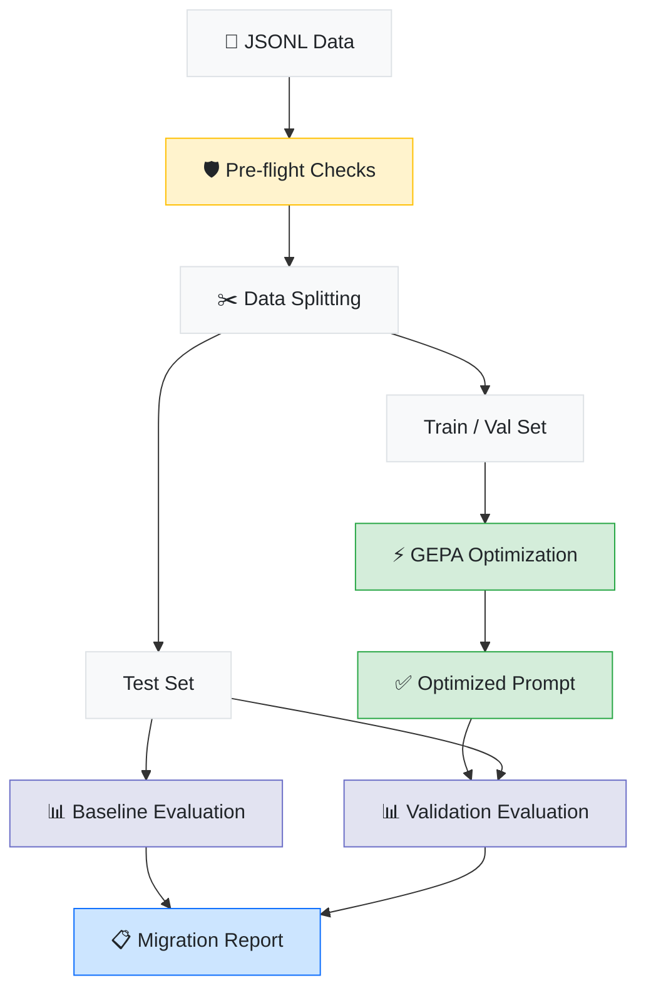
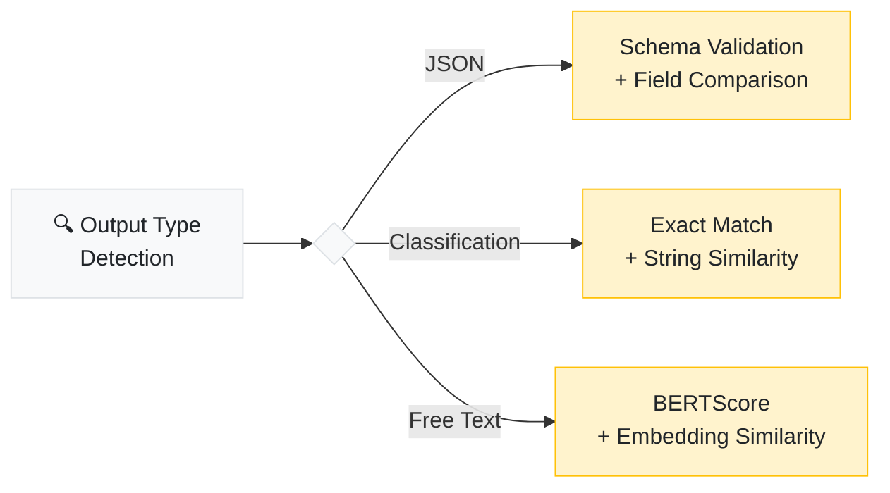

<p align="center">
  
</p>

<p align="center">
  <a href="LICENSE"></a>
  <a href="https://www.python.org/downloads/"></a>
  
</p>

<p align="center">
  <a href="#overview">Overview</a> &nbsp;&nbsp;|&nbsp;&nbsp;
  <a href="#get-started">Get Started</a> &nbsp;&nbsp;|&nbsp;&nbsp;
  <a href="#under-the-hood">Under the Hood</a> &nbsp;&nbsp;|&nbsp;&nbsp;
  <a href="#architecture">Architecture</a> &nbsp;&nbsp;|&nbsp;&nbsp;
  <a href="#glossary">Glossary</a> &nbsp;&nbsp;|&nbsp;&nbsp;
  <a href="#roadmap">Roadmap</a> &nbsp;&nbsp;|&nbsp;&nbsp;
  <a href="DEVLOG.md">Dev Log</a>
</p>

> **Note:** This project is actively under development and not yet production-ready. See the [Roadmap](#roadmap) for current progress and the [Dev Log](DEVLOG.md) for build updates.

---

## Overview

When teams migrate between LLM providers, their prompts break. Different models interpret the same instructions differently — formatting changes, reasoning shifts, outputs come back looking nothing like before. The fix today is manual re-engineering, which typically consumes 20–50% of the original development effort.

RosettaStone automates this process end-to-end. It takes your existing prompt/response pairs, optimizes your prompts for the target model using reflective optimization, and validates the results against a held-out test set — all in a single command.

```bash
rosettastone migrate \
  --data production_pairs.jsonl \
  --from openai/gpt-4o \
  --to anthropic/claude-sonnet-4
```

```
✓ Migration complete

  Confidence ·········· 92%
  Baseline ············ 61%
  Improvement ········· +31%
  Cost ················ $4.20
  Duration ············ 18.3m
  Report ·············· ./migration_output/migration_report.md
```

The core insight: your production data already defines how your model should behave. The old model's outputs are the ground truth — RosettaStone uses them as the optimization target.

---

## Get Started

### Installation

```bash
pip install rosettastone

pip install "rosettastone[eval]"   # adds BERTScore & sentence-transformers
pip install "rosettastone[all]"    # includes everything
```

### Configuration

```bash
export OPENAI_API_KEY=sk-...        # powers the optimization engine
export ANTHROPIC_API_KEY=sk-ant-... # if migrating to an Anthropic model
```

### Usage

**CLI**

```bash
# run a full migration with the included sample data
rosettastone migrate \
  --data examples/sample_data.jsonl \
  --from openai/gpt-4o \
  --to anthropic/claude-sonnet-4

# estimate cost before running
rosettastone migrate \
  --data data.jsonl \
  --from openai/gpt-4o \
  --to anthropic/claude-sonnet-4 \
  --dry-run

# run pre-flight checks only
rosettastone preflight \
  --data data.jsonl \
  --from openai/gpt-4o \
  --to anthropic/claude-sonnet-4
```

**Python Library**

```python
from rosettastone import Migrator, MigrationConfig

result = Migrator(MigrationConfig(
    source_model="openai/gpt-4o",
    target_model="anthropic/claude-sonnet-4",
    data_path="production_pairs.jsonl",
)).run()

print(f"Confidence: {result.confidence_score:.0%}")
print(f"Improvement: +{result.improvement:.0%}")
print(f"Cost: ${result.cost_usd:.2f}")
```

---

## Under the Hood

### Pipeline



### Step Breakdown

| Step | Description |
|:---|:---|
| **Pre-flight Checks** | Validates that the migration is feasible — context window compatibility, feature support, tokenizer differences — and estimates API cost. Runs automatically, or standalone with `--dry-run`. |
| **Data Splitting** | Deduplicates pairs, detects output types (JSON, classification, free text), and splits into train/validation/test sets. The test set is held out from optimization entirely. |
| **Baseline Evaluation** | Runs the test set through the target model using your original prompts. This measures the "migration gap" — how much breaks without any optimization. |
| **GEPA Optimization** | Uses [GEPA](https://arxiv.org/abs/2507.19457) (ICLR 2026 Oral) to iteratively improve prompt instructions. GEPA reflects on *why* outputs diverge and proposes targeted fixes — using ~35× fewer API calls than brute-force approaches. |
| **Validation** | Runs the same held-out test set through the target model with the optimized prompt. Compares against baseline to measure improvement. |
| **Migration Report** | Generates a markdown report: before/after scores, per-category breakdown, worst regressions, and a confidence score (pairwise win rate). |

### Evaluation Strategy

RosettaStone auto-selects evaluation metrics based on your output type:



---

## Data Format

Input is a JSONL file with one prompt/response pair per line. Prompts can be plain text or OpenAI messages format:

```jsonl
{"prompt": "Summarize this article: ...", "response": "The article discusses...", "source_model": "openai/gpt-4o"}
{"prompt": [{"role": "system", "content": "..."}, {"role": "user", "content": "..."}], "response": "...", "source_model": "openai/gpt-4o"}
```

| Field | Required | Description |
|:---|:---:|:---|
| `prompt` | ✓ | Plain text or OpenAI messages array |
| `response` | ✓ | The source model's output |
| `source_model` | ✓ | LiteLLM model identifier (e.g. `openai/gpt-4o`) |
| `metadata` | | Arbitrary key-value pairs |
| `feedback` | | Known issues with this particular response |
| `input_tokens` | | Token count for the prompt |
| `output_tokens` | | Token count for the response |
| `timestamp` | | When this pair was generated |

> **Dataset size:** minimum 20 pairs, recommended 50–200.

---

## Estimated Cost & Performance

For 100 prompt/response pairs using default settings (`--auto light`):

| Target Model | Est. Cost | Est. Time |
|:---|:---|:---|
| GPT-4o-mini | $0.50 – $2 | 5 – 15 min |
| Claude Haiku 4.5 | $2 – $6 | 10 – 25 min |
| GPT-4o | $5 – $15 | 15 – 45 min |
| Claude Sonnet 4.5 | $8 – $20 | 20 – 60 min |

Optimization intensity is configurable via `--auto`: `light` (default), `medium`, or `heavy`.
Higher intensity = more API calls, better results.

> Use `--dry-run` to get a cost estimate before committing.

---

## Architecture

```
src/rosettastone/
│
├── cli/                Typer CLI — migrate, preflight, evaluate
│
├── core/
│   ├── migrator.py     Orchestrator — runs the full pipeline
│   ├── pipeline.py     Step definitions, wiring between subsystems
│   └── types.py        PromptPair, EvalResult, MigrationResult
│
├── config.py           MigrationConfig (Pydantic v2)
├── preflight/          Capability checks, token budgets, cost estimation
├── ingest/             DataAdapter interface — JSONL adapter (MVP)
├── optimize/           GEPA wrapper, DSPy program, metric function
├── evaluate/           BERTScore, embeddings, exact match, JSON validation
├── report/             Jinja2 markdown report generation
└── utils/              Logging (never logs prompt content), LiteLLM helpers
```

**Design Principles:**

- **Provider-agnostic** — supports 100+ models through [LiteLLM](https://github.com/BerriAI/litellm)
- **Pluggable** — abstract base classes for data adapters, optimizers, and evaluators. Adding a new data source or metric means implementing one interface.
- **CLI = Library** — both paths construct a `MigrationConfig` and call `Migrator.run()`. No divergent code paths.
- **Lazy optional deps** — `bert-score`, `sentence-transformers`, and `redis` only load when called, with graceful fallbacks.
- **Additive phases** — each phase adds new files without rewriting existing ones. Phase 1 code stays stable through Phase 5.

---

## Roadmap

| Phase | Scope | Status |
|:---:|:---|:---:|
| **1** | CLI + Python library, JSONL ingestion, GEPA optimization, multi-strategy evaluation, markdown reports | 🔨 In Progress |
| **2** | Redis ingestion, LLM-as-judge evaluation, PII detection, known-issue feedback weighting | ⏳ Planned |
| **3** | Web UI (FastAPI + React), side-by-side diffs, PDF/HTML reports, executive dashboard | ⏳ Planned |
| **4** | LangSmith / Braintrust / OpenTelemetry adapters, CI/CD integration | ⏳ Planned |
| **5** | Multi-step pipeline migration, A/B testing, versioning, enterprise features | ⏳ Planned |

---

## Glossary

| Term | Definition |
|:---|:---|
| **GEPA** | Genetic-Pareto prompt optimizer ([ICLR 2026 Oral](https://arxiv.org/abs/2507.19457)). Instead of brute-forcing prompt variations, it reflects on *why* outputs diverge and proposes targeted fixes. ~35× fewer API calls than previous methods. |
| **DSPy** | Framework for programming language models as optimizable modules — handles the training loop, caching, and program compilation. [dspy.ai](https://dspy.ai) |
| **LiteLLM** | Universal API wrapper providing a single interface to 100+ LLM providers. |
| **BERTScore** | Semantic similarity metric computed locally (no API calls). More meaningful than string matching for evaluating free-text responses. |
| **Behavioral equivalence** | The migration objective — outputs from the new model should match the old model's intent, structure, and quality. Not word-for-word identical, but functionally equivalent. |
| **Pairwise win rate** | The confidence metric. 92% means the optimized prompt on the new model matched or exceeded the old model's output in 92 of 100 test cases. |
| **Tokenizer inflation** | The same text produces different token counts across models. Moving from tiktoken (OpenAI) to SentencePiece (Anthropic) typically inflates token count by 15–20%. |
| **Reflection model** | The model GEPA uses to analyze failures and propose improvements. Defaults to GPT-4o, always separate from the migration target. |
| **Pre-flight checks** | Safety validation before the migration runs. Catches context window overflow, missing capabilities, and high cost estimates before any API spend. |

---

## References

- **[GEPA paper](https://arxiv.org/abs/2507.19457)** (ICLR 2026 Oral) — The core optimization algorithm behind RosettaStone. Introduces reflective prompt evolution that outperforms MIPROv2 by 10%+ while using ~35× fewer API calls.
- **[Dropbox — DSPy + GEPA in production](https://dropbox.tech/machine-learning/optimizing-dropbox-dash-relevance-judge-with-dspy)** — Production case study validating that GEPA + DSPy can optimize real-world LLM systems at scale, not just benchmarks.
- **[AWS — Prompt migration with DSPy MIPROv2](https://aws.amazon.com/blogs/machine-learning/improve-amazon-nova-migration-performance-with-data-aware-prompt-optimization/)** — AWS's reference architecture for data-aware prompt migration. Demonstrates the general pattern RosettaStone builds on, using the previous-generation optimizer.

---

## Development

```bash
git clone https://github.com/ashwinchidambaram/rosettastone.git
cd rosettastone
uv sync --dev --all-extras

uv run pytest tests/ -v          # run tests
uv run ruff check src/ tests/    # lint
uv run ruff format src/ tests/   # format
uv run mypy src/rosettastone/    # type check
```

---

<p align="center">
  <strong>MIT License</strong> — see <a href="LICENSE">LICENSE</a>
</p>

<a href="https://github.com/ashwinchidambaram"></a>
